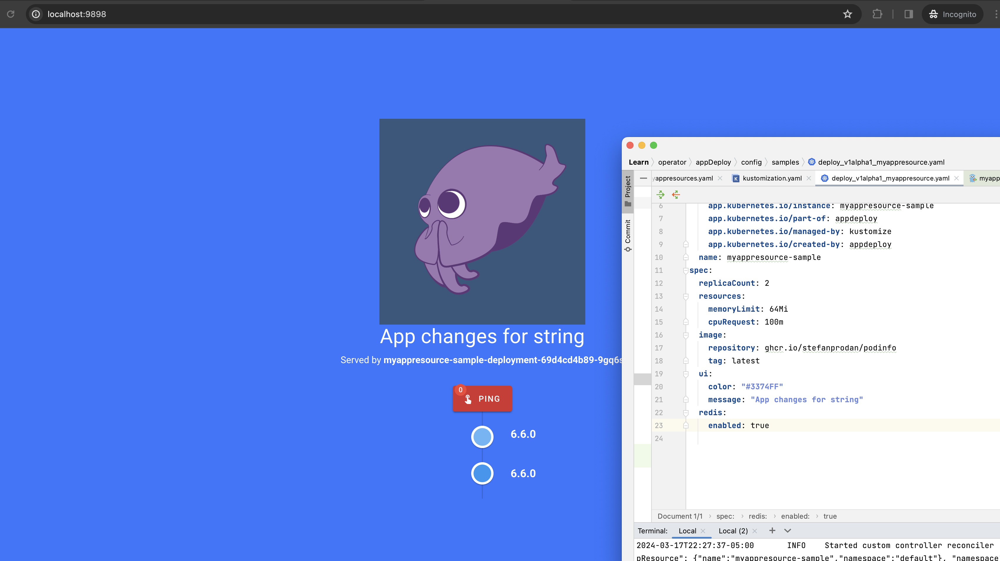
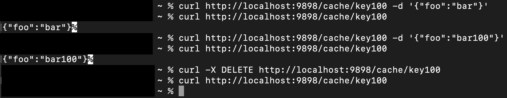

# appdeploy
## Custom controller to deploy app and cache datastore

## Description
Controller app-deploy built using [kubebuilder](https://book.kubebuilder.io/). Installing this will install a crd resource with name `myappresources.deploy.my.api.group` and once the controller is deployed, it will read crd objects of kind `MyAppResource` and create resources. Definition for this file is [here](./config/crd/bases/deploy.my.api.group_myappresources.yaml). A sample crd kubernetes manifest containing relevant specs can be referenced [here](./config/samples/deploy_v1alpha1_myappresource.yaml). 

### Prerequisites
- go version v1.21.0+
- docker version 20.10+.
- kubectl version v1.24+.
- Access to a Kubernetes v1.24+ cluster.

### Compile and build
```sh
make all
```
To Compile the code and build binary on local machine run the above command<br>
The definition for all make commands can be referenced in [file](./Makefile). `make all` uses controller-gen to generate crds,rbac and manifests based on code

### Test
```sh
make test
```
Currently only one test case is written for validating that the resources will get created.<br>
TO:DO test cases to cover updates to crd and deleting crds

### To Deploy on the cluster
**Build and push your image to the location specified by `IMG`:**

```sh
make docker-build docker-push IMG=<user-registry>/appdeploy:tag
```

**NOTE:** This image ought to be published in the personal registry.<br> 
Ensure you have the proper permission to the registry if the above commands don’t work.<br>
For controller to be deployed, k8s should have access to pull image from this registry

**Install the CRDs into the cluster:**

```sh
make install
```

**Deploy the Controller Manager to the cluster with the image specified by `IMG`:**

```sh
make deploy IMG=<user-registry>/appdeploy:tag
```

> **NOTE**: If you encounter RBAC errors, you may need to grant yourself cluster-admin 
privileges or be logged in as admin.

**To deploy custom resource**
You can apply the samples (examples) from the config/sample:

```sh
kubectl apply -k config/samples/
```
If you prefer a different custom resource yaml manifest, you can provide that instead of editing this [file](./config/samples/deploy_v1alpha1_myappresource.yaml)

### Validation
Based on the values provided in the custom resource, you should be able to see kubernetes resources created in the cluster<br>
Modify values in the custom resource and apply again with 
```sh
kubectl apply -k config/samples/
```
The controller will configure resources based on the changes and it can be validated by inspecting the resources.<br>

### Application verification
**Port Forwarding to access UI**<br>
```sh
kubectl port-forward deploy/<deployment_name> 9898:9898
```
The app runs on port 9898 and running this command will make the app available on your localhost on the same port.<br>
This can be accessed in the web browser by opening http://localhost:9898 after you run the port-forward command.<br>


### Cache function verification


### To Uninstall
**Delete the instances (CRDs) from the cluster:**

```sh
kubectl delete -k config/samples/
```

**Delete the APIs(CRDs) from the cluster:**

```sh
make uninstall
```

**UnDeploy the controller from the cluster:**

```sh
make undeploy
```

**NOTE** Deleting only the crd will also delete all resources

## License

Copyright 2024.

Licensed under the Apache License, Version 2.0 (the "License");
you may not use this file except in compliance with the License.
You may obtain a copy of the License at

    http://www.apache.org/licenses/LICENSE-2.0

Unless required by applicable law or agreed to in writing, software
distributed under the License is distributed on an "AS IS" BASIS,
WITHOUT WARRANTIES OR CONDITIONS OF ANY KIND, either express or implied.
See the License for the specific language governing permissions and
limitations under the License.

